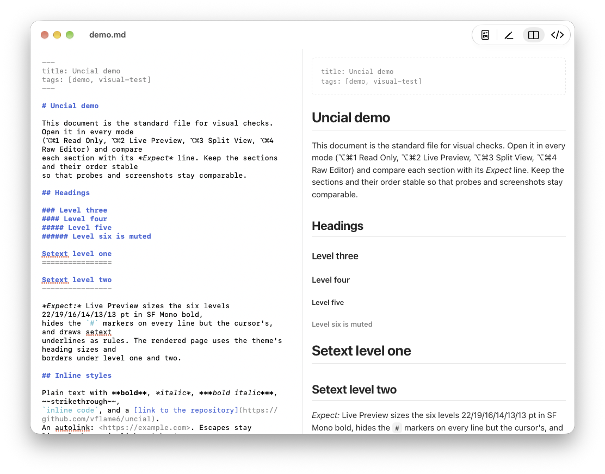

# Uncial

Uncial is a small native macOS Markdown reader and editor. 

Created by Maksim Radaev/[@vflame6](https://github.com/vflame6)



## Features

- GitHub-flavored Markdown: tables, task lists, strikethrough, autolinks,
  footnotes, fenced code, raw HTML, LaTeX math and Mermaid diagrams, rendered
  without running any script in the page.
- Syntax highlighting in fenced code for about 50 languages, from Python,
  JavaScript, TypeScript, Java, C, C++, C#, Go, Rust, Swift, Kotlin, Ruby, PHP,
  SQL and shell to Fortran, COBOL, Prolog, MATLAB, Pascal and Scratch, plus JSON,
  YAML, HTML, CSS, diff and more, with colors that follow the theme in the
  rendered page, in Quick Look and in the editor.
- Four modes per window: Read Only, Live Preview (Markdown rendered in place),
  Split View and Raw Editor.
- Three themes, each with a light and a dark variant: macOS, GitHub and Solarized.
- A Markdown-aware source editor: syntax coloring, auto-closing pairs, list and
  quote continuation, find and replace, optional line numbers, and scroll sync
  in Split View.
- Save with ⌘S, or let Uncial save as you type.
- Re-rendering when the file changes on disk, scroll position kept.
- Local images, heading anchors, YAML front matter, and links that open in the
  browser or, for local Markdown files, in a new window. Nothing is loaded from
  the web unless you allow it in Settings ▸ General: remote images and other
  references stay unloaded in the window, in Live Preview and in Quick Look, so
  opening a file tells no server about it.
- Attachments found where you keep them: an image or linked file that is not
  next to the document is looked for in its `attachments` folder and then,
  folder by folder, above the document. Settings ▸ General sets the folder
  name, whether the folders above are searched, and whether the search stops at
  your home folder or at the root of the disk.
- Paste or drop files and pictures into the editor: the file is copied where
  new attachments go (Settings ▸ General chooses the folder, created as needed)
  and the Markdown for it, an image or a link, is inserted at the cursor.
- Quick Look preview and thumbnails for Markdown files.
- Optional status bar with line, word and character counts. Pinch to zoom.

## Requirements

- macOS 14 Sonoma or later.
- Xcode 26 to build from source.

## Install

With [Homebrew](https://brew.sh):

```sh
brew tap vflame6/uncial https://github.com/vflame6/uncial
brew install --cask uncial
```

From source:

```sh
git clone https://github.com/vflame6/uncial.git
cd uncial
make install
```

`make install` builds a Release `Uncial.app`, copies it to `/Applications`,
launches it once so macOS registers the Quick Look extensions, and clears the
Quick Look cache. You can also open `uncial.xcodeproj` in Xcode, pick the
`uncial` scheme, and run.

## Enabling the Quick Look extensions

1. Select any `.md` file in Finder and press Space. You should see the rendered
   document, and the file's icon should show a small page of it.
2. If you still see plain text, open System Settings ▸ General ▸
   Login Items & Extensions ▸ Quick Look and enable **Uncial Quick Look** (previews)
   and **Uncial Thumbnails** (icons and Open panels).
   (On macOS 14 the switches live under Privacy & Security ▸ Extensions ▸ Quick Look.)
3. Reset Quick Look if needed; the cache reset also throws away old thumbnails:

   ```sh
   qlmanage -r && qlmanage -r cache
   ```

Only one Quick Look extension can preview a file type, and one can draw its
thumbnails. If another Markdown previewer is installed (QLMarkdown, Peek,
Marked, …), disable it in the same settings pane or macOS may keep using it.

## Usage

- Right-click a Markdown file ▸ Open With ▸ Uncial, drop it on the Dock icon, or
  run `open -a Uncial README.md`. Uncial and its Quick Look extensions handle
  `.md` and `.markdown` files as well as `.mdown`, `.mkd`, `.mkdn`, `.mkdown`,
  `.mdwn`, `.mdtxt` and `.mdtext`.
- File ▸ Open (⌘O) and Open Recent work as in any document app. File ▸ New… (⌘N)
  asks where to create an empty Markdown file and opens it.
- View ▸ Reload (⌘R) re-reads the file if you ever need to force it.
- Settings (⌘,) opens on General (appearance, theme, Quick Look, default app,
  attachments, loading from the web); the other tabs are Editor, Shortcuts and
  About. The General controls are offered once in a Welcome window on first launch.

### Editing

Every document window has a mode, chosen with the segmented control in the
toolbar, the View menu, or the keyboard:

| Mode | Shows | Shortcut |
|---|---|---|
| Read Only | The rendered document | ⌥⌘1 |
| Live Preview | One editor with the Markdown rendered in place; the line with the cursor shows its source | ⌥⌘2 |
| Split View | Markdown source on the left, rendered document on the right | ⌥⌘3 |
| Raw Editor | Markdown source only | ⌥⌘4 |

⇧⌘E cycles through the four. New windows start in the mode chosen in
Settings ▸ Editor (Split View by default).

Edits stay in the window until you save with ⌘S: a window with unsaved changes
shows the dot in its close button, and closing it, quitting or reloading asks
whether to save. Turn on *Save changes automatically* in Settings ▸ Editor to
have Uncial write the file half a second after you stop typing instead, without
asking. If another program changes the file while you have no unsaved edits, the
window picks up the new contents. With unsaved edits, Uncial asks whether to keep
them or reload the file (Settings ▸ Editor can make it keep or reload without
asking), and before every save it re-reads the file, so a change made by Git, a
sync service or another editor in the meantime is never overwritten blindly.

Live Preview renders Markdown where it stands, in the theme's page fonts and
sizes: headings, emphasis, code, links, lists, task boxes, quotes, tables,
images, diagrams and math. The line under the cursor (or the fenced block it is
in) shows its source instead, in the Raw Editor's monospace look with every
marker, and returns to the rendered look when the cursor leaves. In Split View the
source and the rendered page scroll together. Settings ▸ Editor holds the
editor options: line numbers, auto-closing of brackets and Markdown markers,
list and quote continuation, text size, the readable column in Live Preview,
scroll sync and the split ratio. Edit ▸ Find (⌘F) and Find and Replace… (⌥⌘F)
search the source, or the rendered page in Read Only.

## Development

```sh
make core-test   # unit tests for the renderer and watcher (swift test)
make test        # core tests + app unit tests via xcodebuild
make build       # Release build into ./build
make highlight   # rebuild the highlight.js bundle (scripts/build-highlight.sh)
make clean
```

`static/demo.md` exercises every rendering and editing feature with an *Expect* note
per section; open it in each mode to check a change by eye.

The Makefile exports `DEVELOPER_DIR=/Applications/Xcode.app/Contents/Developer`,
so the commands work even when `xcode-select` points at the Command Line Tools.
Override it with `make DEVELOPER_DIR=/path/to/Xcode.app/Contents/Developer …`.

### Project structure

| Part | What it does |
|---|---|
| `Packages/UncialCore` | Swift package. Turns Markdown into a self-contained HTML page: cmark-gfm parsing, heading ids, front matter, math (KaTeX), diagrams (beautiful-mermaid) and code highlighting (highlight.js) done through JavaScriptCore at render time, image inlining, and the three themes as CSS. Also the file watcher and the block outline the thumbnails draw. |
| `uncial` (app target) | SwiftUI document app. Shows the HTML in a `WKWebView` with page JavaScript disabled and swaps the rendered body in place as you type. An `NSTextView` provides the editor; the view model keeps the editor's text, writes it to the file on ⌘S (or as you type, when automatic saving is on) and reconciles changes that arrive from other programs. A hidden web view runs mermaid.js for the diagram types beautiful-mermaid lacks and draws every diagram to a bitmap for Live Preview. Settings and the first-run Welcome window drive `pluginkit` and `NSWorkspace` for the two system integrations. |
| `UncialQuickLook` | Quick Look Preview Extension. Returns the same HTML through `QLPreviewReply`, so Finder renders it. Reads the theme, and the diagrams mermaid.js drew in the app, from the App Group container the app writes to (WebKit cannot run inside the extension). |
| `UncialThumbnail` | Quick Look Thumbnail Extension. Draws the document's outline (headings, text, lists, quotes, code, rules, tables) as a small page with AppKit for Finder icons, Open panels and Get Info, in the theme's light colors. |

## Contributing

Feel free to open an issue if something does not work, or if you have any ideas to improve the tool.

