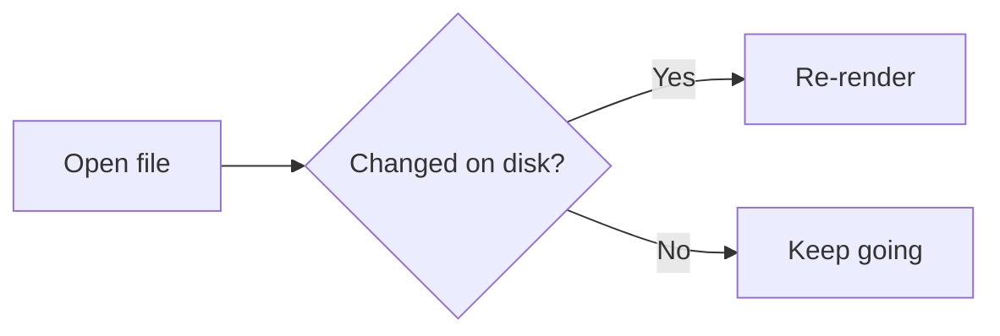
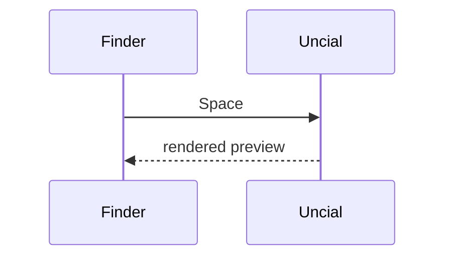
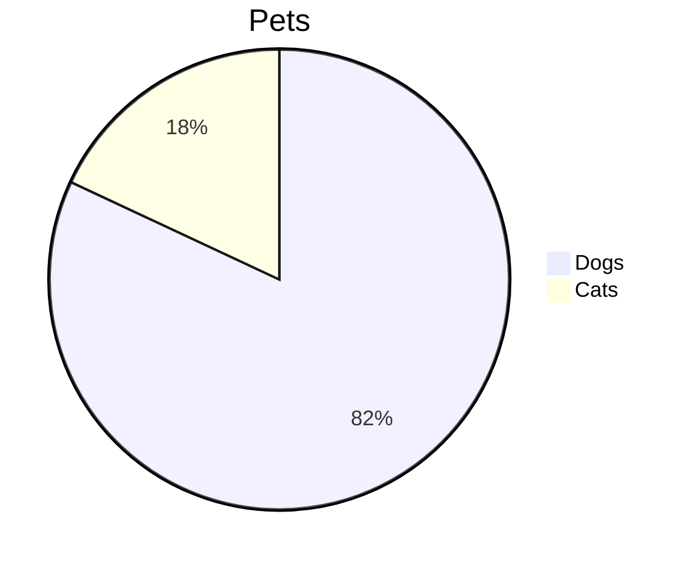
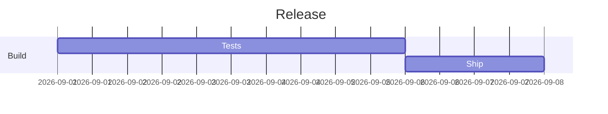
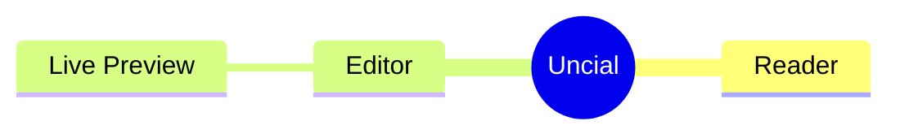

# Uncial demo

This document is the standard file for visual checks. Open it in every mode
(⌥⌘1 Read Only, ⌥⌘2 Live Preview, ⌥⌘3 Split View, ⌥⌘4 Raw Editor) and compare
each section with its *Expect* line. Keep the sections and their order stable
so that probes and screenshots stay comparable.

## Headings

### Level three
#### Level four
##### Level five
###### Level six is muted

Setext level one
================

Setext level two
----------------

*Expect:* Live Preview sizes the six levels 22/19/16/14/13/13 pt in SF Mono bold,
hides the `#` markers on every line but the cursor's, and draws setext
underlines as rules. The rendered page uses the theme's heading sizes and
borders under level one and two.

## Inline styles

Plain text with **bold**, *italic*, ***bold italic***, ~~strikethrough~~,
`inline code`, and a [link to the repository](https://github.com/vflame6/uncial).
An autolink: <https://example.com>. Escapes stay literal: \*not italic\*, 3 \* 4,
snake_case, ~5 min, and 2 * 3 * 4.

A footnote reference[^note] and inline <b>HTML</b> tags <!-- with a comment -->.

[^note]: Footnote definitions render on their own line.

*Expect:* markers hidden off the cursor line and shown muted on it; the code
sits on a tint; the link is in the accent color and ⌘-click opens it; the
footnote mark is a small raised "note"; escape backslashes and HTML tags hide
with the other markers, so the comment vanishes and HTML reads bold.

## Lists

- Bullet item
- Bullet with **bold**, `code` and a [link](https://example.com)
  - Nested bullet
    - Third level
- A long bullet that keeps going long enough to wrap onto a second visual line in the readable column so the hanging indent under the text can be checked.
1. First numbered item
2. Second numbered item
   1. Nested numbered item
   2. Another nested item
- [ ] Open task
- [x] Done task
- [ ] Task with *emphasis* and a [link](https://example.com)

*Expect:* bullets drawn as •, numbers in the accent color, wrapped lines hanging
under their text, task boxes drawn as squares that toggle on click (undoable,
saved to the file).

## Quotes

> A quoted paragraph with **bold** text and `code`.
> A second line of the same quote.
>
> > A nested quote.

*Expect:* one bar per level in the muted color, `>` markers hidden, the text
muted.

## Code

```swift
struct Demo {
    let answer = 42   // a comment
    func run() -> Int { answer * 2 }
}
```

~~~
A tilde fence without an info string.
~~~

    An indented code block (four spaces) stays as source in Live Preview.

*Expect:* fenced blocks on a rounded tint spanning every line, fence lines
hidden except the info string `swift`, code in the code color, no syntax
highlighting inside. Put the cursor inside a block: the whole block reveals.

## Table

| Name   | Qty | Price | Note                        |
|:-------|----:|:-----:|-----------------------------|
| Apple  |   3 |  1.20 | **fresh**                   |
| Banana |  12 |  0.50 | with `code`                 |
| Cherry | 100 | 12.00 | [link](https://example.com) |

*Expect:* columns aligned (Qty right, Price centered), header bold, delimiter
row drawn as a rule, outer pipes hidden, inner pipes muted; a revealed row
shows its raw pipes and stays padded.

## Rules

Text above a rule.

---

* * *

*Expect:* two thin lines; the second one comes from spaced asterisks. The `---`
right under "Setext level two" above is a heading underline, not a rule.

## Images


A remote image: 

*Expect:* the local icon drawn under its line at 128 pt with the alt text above
it; the remote one appears the same way once it has loaded (Live Preview and the
rendered page both fetch it; Quick Look has no network and shows nothing).

## Links and anchors

Jump to [Headings](#headings) or [Table](#table). A reference-style link
[renders like an inline one][ref]; its definition line below stays muted.

[ref]: https://example.com

A link to a local Markdown file opens a new Uncial window: [this file](demo.md).

## HTML

<div align="center">This div is centered in Live Preview and in the rendered page.</div>

Inline tags: <b>bold</b>, <i>italic</i>, <u>underlined</u>, <kbd>⌘</kbd>, H<sub>2</sub>O,
x<sup>2</sup>, <mark>marked</mark>, <a href="https://example.com">a link</a>, and an image tag:


*Expect:* tags hidden off the cursor line, the div text centered, the inline tags styled like
their Markdown equivalents, the image drawn under its line at 128 pt. A multi-line block only
hides its tag lines; comments and `<br>` leave nothing behind.

## Math

Inline math $E = mc^2$ and $\frac{a}{b}$ sit in the text; prices like $5 and $10
are not math. Display math stands alone:

$$
\int_0^1 x^2 \, dx = \frac{1}{3}
$$

```math
\sum_{n=1}^{\infty} \frac{1}{n^2} = \frac{\pi^2}{6}
```

*Expect:* the rendered page shows real formulas (KaTeX to MathML, no script); Live
Preview keeps the TeX in the code color with the dollars hidden off the cursor line
and tints the `$$` block like code. Bad TeX shows in red with its source.

## Diagrams











*Expect:* every diagram is a vector drawing in the theme's colors: in the rendered page, in Quick
Look, and in Live Preview, where a fence shows its source only while the caret is inside it.
Flowcharts, sequence, state, class and ER diagrams and XY charts come from beautiful-mermaid and
follow the theme live; everything else comes from mermaid.js in a hidden web view, drawn once
per appearance. No script runs in the page.

## Not rendered on purpose

Front matter and reference link definitions stay visible but muted.

## Find and status bar

The word needle appears three times in this paragraph: needle, and once more,
needle. Use ⌘F in every mode; the Read Only bar should report "3 found" when
searching for needle. 🔥 Emoji count as characters, not words; don't, well-known
and 3,857 are one word each.

## Editing checks (Live Preview or Raw Editor)

1. Type `(` at the end of this line: a `)` appears after the cursor →
2. Type `**` here: a `**` pair grows around the cursor →
3. Press Return at the end of this item: a `4.` item appears →
- [ ] Press Return at the end of this task: a new `[ ]` item appears →
- Press Return twice on an empty item: the list ends →

> Press Return at the end of this quote: the `>` prefix continues →

Type three backticks and Return on the empty line below to get a fenced block:

*Expect:* auto-pairing, list and quote continuation, and fence creation as
described in README; ⌘Z undoes each step.
